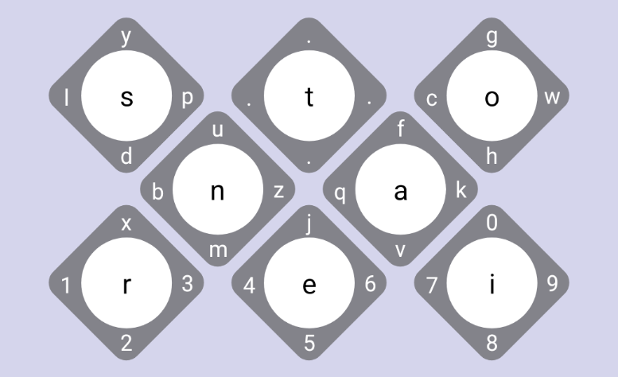

# KeyQuartz Mobile Phone Keyboard

This keyboard tries to make touch typing on a mobile device easier and faster by minimizing the number of buttons

## Purpose

The original keyboards were created for situations where both hands and all your fingers are available. However, it doesn't make as much sense when we are using those layouts with only two thumbs. Buttons become very small, increasing typing errors and reliance on intelligent auto-correct features. KeyQuartz was created for the purpose of having a keyboard that minimizes typing errors with larger and fewer buttons and the ability to swipe those buttons for less common letters and characters.

## Layout
